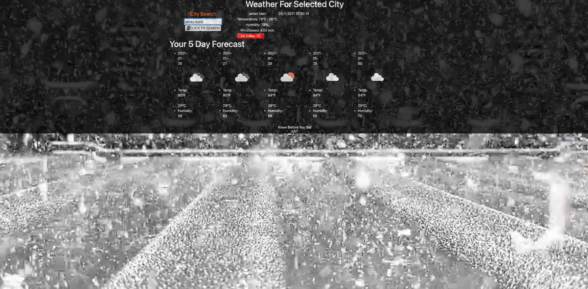

### --------JHU CODING BOOTCAMP - HOMEWORK #5 WEATHER DASHBOARD 

#### OVERVIEW
- The Weather Dashboard Application was designed to give the user a simple easy to use weather app for desktop or mobile devices. Weather Dashboard Application allows users to select City of Interest by entering a 5 diget zip-code. The Application will pull API data such as temperature, humidity, WindSpeed,uv index,a and current date and time. 

#### Technology Used

- HTML
- CSS
- JAVASCRIPT
- FONT-AWESOME
- BOOTSTRAP
- JQUERY

#### LINKS 
###### LINK TO RUNNING APPLICATION
- https://spental.github.io/weather-Dash/
###### LINK TO SPENTAL GITHUB ACCOUNT
- https://github.com/spental/weather-Dash
#### SCREEN SHOTS
- Working Application (Home Screen)

- Working Application (City #1 )

- Working Application (City #2)
